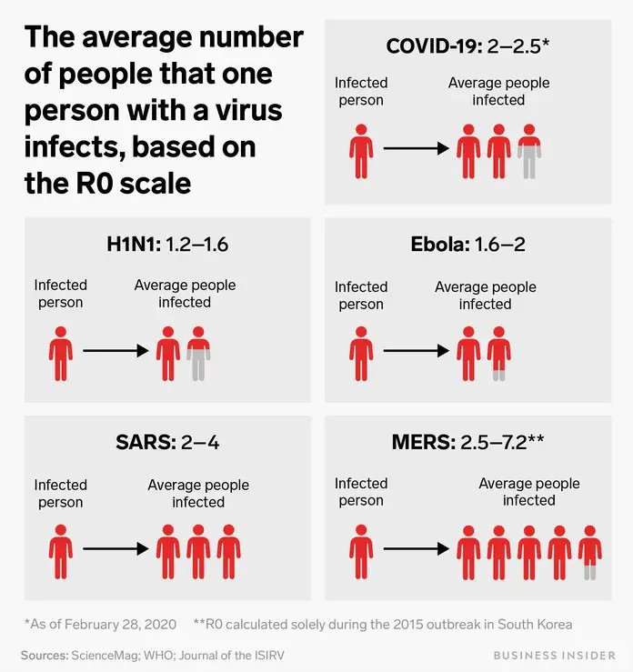

```{r setup, include=FALSE}
knitr::opts_chunk$set(echo = TRUE)
library(reticulate)
library(knitr)
library(kableExtra)
library(tidyverse)
use_python("C:/Users/Elias/AppData/Local/Programs/Python/Python38")
```

# Introduccion.

Los datos que se van a analizar en este documento, proceden de la compilación publicada 
por el gobierno de México, los cuales se pueden consultar [aqui](https://coronavirus.gob.mx/datos/#DownZCSV). La fecha del ánalisis empieza el 02 de Junio de 2020, utilizando la versión acualizada al 01 de Junio de 2020.

El gobierno mexicano está actualizando diariamente su información disponible relacionada con COVID-19, es importante analizar esta información para comprender cómo evolucionará la situación.

### Notas
* Los gráficos y las predicciones se actualizan diariamente.
* Algunas parcelas se basan en información obtenida de los conjuntos de datos públicos.
* Esta no es una declaración política, sino un análisis crítico de la situación actual.

*Es importante saber que las estimaciones gubernamentales según el subsecretario Dr. Hugo López-Gatell Ramírez son 8 veces el número de casos oficiales.*

## LIBRERIAS

```{python}
import matplotlib.pyplot as plt
import networkx as nx
import pandas as pd
import numpy as np
import matplotlib
import datetime, json, glob, unidecode
from pandas.plotting import register_matplotlib_converters
register_matplotlib_converters()
plt.rcParams.update({'font.size': 17, 'lines.linewidth':4})
```

## Frame de Datos

Se creo un frame de datos a partir de los casos confirmados, en donde podemos consultar de forma mas facil los confirmados acumulados, la fecha de incubacion del virus
```{python}
c_pday = [3,4,5,5,5,5,5,6,6,7,7,7,11,15,26,41,53,82,93,118,164,203,251,316,367,405,475,585,717,848,993,1094,1215,1378,1510,1688,1890,2143,2439,2785,3181,3441,
          3844,4219,4661,5014,5399,5847,6297,6875,7497,8261,8772,9501,10544,11633,12872,13842,14677,15529,16752,17799,19224,20739,22088,
          23471,24905,26025,27634,29616,31522,33460,35022,36327,38324,40186,42595,45032,47144,49219,51633,54346,
         56594,59567,62527,65856,68620,71105,74560,78023,81400,84627,87512,90664,93435,97326]
mx_confirmed_cases = np.array(c_pday)

def get_date_list(base, total=len(mx_confirmed_cases)):
    return [(base - datetime.timedelta(days=x)).strftime("%d-%b-%Y") for x in range(total)][::-1]

# Crear el frame de datos
mx_covid = pd.DataFrame(mx_confirmed_cases, columns=['Confirmed Cases'])

# Muertes confirmadas
d_pday = [0,0,0,0,0,0,0,0,0,0,0,0,0,0,0,0,0,0,0,0,0,0,0,0,4,5,6,8,12,16,20,28,29,37,50,60,79,94,125,141,174,194,233,273,296,332,406,449,486,546,650,686,712,
          857,970,1069,1221,1305,1351,1434,1569,1732,1859,1972,2061,2154,2270,2507,2704,2961,3160,3353,
          3465,3573,3926,4220,4477,4767,5045,5177,5332,5666,6090,6510,6989,7179,7394,7633,
          8134,8597,9044,9415,9779,9930,10167,10637]
mx_covid['Deceased'] = d_pday

# Obtener las fechas de los datos confirmados
date_list = get_date_list(datetime.datetime.today() - datetime.timedelta(days=1))
mx_covid['Dates'] = date_list


# Salvar el frame de datos
mx_covid.to_csv('covid_mx.csv',index=False)
mx_covid.head()
```


# Dataset completo (con dias de incubacion)
```{python}
# ----------------
# Dataset Completo
# ----------------
path = 'covid-19_general_MX.csv'
df = pd.read_csv(path)
df['DIAS_INCUBACION'] = pd.to_datetime(df['FECHA_INGRESO'])-pd.to_datetime(df['FECHA_SINTOMAS'])
df['DIAS_INCUBACION'] = df['DIAS_INCUBACION'].dt.days
positive_ip_g14 = df.loc[(df['DIAS_INCUBACION'] > 14) & (df['RESULTADO'] == 1)]
df.head()
```


## Dando Formato a la tabla
```{r}
kable(head(py$df))%>% kableExtra::kable_styling(bootstrap_options = "striped", full_width = F,
                                                              position = "left", font_size = 9)
```


## Leyendo los datos del Dataset
```{python}
fig, ax = plt.subplots(figsize=(15,4))
ax.text(0.0, 0.7, 'El dataset contiene actualmente {} personas'.format(len(df)), dict(size=30))
ax.text(0.0, 0.5, 'de los cuales {} personas han muerto.'.format(len(df.loc[(df['FECHA_DEF'] != '9999-99-99') & (df.FECHA_DEF.notnull())])), dict(size=30))
ax.text(0.0, 0.0, 'No hay informacion de pacientes recuperados.'.format(len(df.loc[(df['FECHA_DEF'] != '9999-99-99') & (df.FECHA_DEF.notnull())])), dict(size=20))
ax.axis('off')
plt.show()
```


# Casos Confirmados de COVID-19
```{python}
import matplotlib.pyplot as plt
import networkx as nx
import pandas as pd
import numpy as np
import matplotlib
import datetime, json, glob, unidecode
from pandas.plotting import register_matplotlib_converters
register_matplotlib_converters()
plt.rcParams.update({'font.size': 17, 'lines.linewidth':4})

covid_positive = df.loc[df['RESULTADO'] == 1]
deads_positive = df.loc[(df['RESULTADO'] == 1) & (df['FECHA_DEF'] != '9999-99-99') & (df.FECHA_DEF.notnull())]
alive_intubated = df.loc[(df['RESULTADO'] == 1) & ((df['FECHA_DEF'] == '9999-99-99') | (df.FECHA_DEF.isnull())) & (df['INTUBADO'] == 1)]
icu_alive = df.loc[(df['RESULTADO'] == 1) & ((df['FECHA_DEF'] == '9999-99-99') | (df.FECHA_DEF.isnull())) & (df['UCI'] == 1)]

cpcounts = len(covid_positive)
dpcounts = len(deads_positive)
aicounts = len(alive_intubated)
iccounts = len(icu_alive)

colors = ['#b00c00', '#edad5f', '#d69e04', '#b5d902', '#63ba00', '#05b08e', '#128ba6', '#5f0da6', '#b30bb0', '#c41484', '#a1183d', '#3859eb', '#4da1bf', '#6bcfb6']

sizes = np.array([cpcounts-dpcounts-aicounts-iccounts, dpcounts, iccounts,aicounts])
# Plot
fig, ax1 = plt.subplots(figsize=(20,10))
ax1.set_title('Distribucion de casos confirmados de COVID-19')
patches, texts = ax1.pie(sizes,colors=colors, startangle=90, shadow=True, explode=(0.0,0.1,0.1,0.1),
                         wedgeprops={'linewidth': 2,"edgecolor":"#303030", 'linestyle': 'solid', 'antialiased': True})

porcent = 100.*sizes/sizes.sum()
tags = ['Positivos', 'Fallecidos', 'Personas en cuidados intensivos', 'Personas intubadas']
labels = ['{0} - {1:0.2f}% = {2:0.0f}'.format(tags[x],porcent[x],sizes[x]) for x in range(len(tags))]

ax1.legend(patches, labels, loc='best', bbox_to_anchor=(-0.1, 1.), fontsize=15)
fig.tight_layout()
plt.show()
```


# Tasa de Mortalidad
```{python}
fig, ax = plt.subplots(figsize=(11,3))
ax.text(0.0, 1.0, 'Sin especulaciones la tasa de mortalidad es de {0:.2f}%'.format(porcent[1]), dict(size=22))
ax.text(0.0, 0.5, 'y {0:.2f}% de los pacientes confirmados por COVID-19 se'.format(porcent[2]+porcent[3]), dict(size=22))
ax.text(0.0, 0.0, 'se encuentran en cuidados intensivos.'.format(porcent[2]+porcent[3]), dict(size=22))
ax.axis('off')
plt.show()
```


```{python}
deads_negative = df.loc[(df['RESULTADO'] == 2) & (df['FECHA_DEF'] != '9999-99-99') & (df.FECHA_DEF.notnull())]
deads_pending = df.loc[(df['RESULTADO'] == 3) & (df['FECHA_DEF'] != '9999-99-99') & (df.FECHA_DEF.notnull())]

dpcounts
dncounts = len(deads_negative)
dpecounts = len(deads_pending)

sizes = np.array([dpcounts,dncounts,dpecounts])
# Plot
fig, ax1 = plt.subplots(figsize=(20,10))
ax1.set_title('Correlacion de las muertes y los resultados del Test por COVID-19')
patches, texts = ax1.pie(sizes,colors=colors, startangle=90, shadow=True, explode=(0,0,0.2),
                         wedgeprops={'linewidth': 2,"edgecolor":"#303030", 'linestyle': 'solid', 'antialiased': True})

labels = ['{0} - {1:.2f}% = {2}'.format(i,100*j/sum(sizes),j) for i,j in zip(list(['Positiva', 'Negativa', 'Pendiente']), sizes)]
sort_legend = False
if sort_legend:
    patches, labels, dummy =  zip(*sorted(zip(patches, labels, sizes),
                                          key=lambda x: x[2],
                                          reverse=True))


ax1.legend(patches, labels, loc='best', bbox_to_anchor=(-0.1, 1.), fontsize=15, title="Resultado del Test")
fig.tight_layout()
plt.show()
```


## Relacion de Muertes y positivos al Test COVID-19
```{python}
positive_death_ninp = df.loc[(df['RESULTADO'] == 1) & (df['NEUMONIA'] != 1) & (df['INTUBADO'] != 1) & (df['FECHA_DEF'] != '9999-99-99') & (df.FECHA_DEF.notnull())]
positive_death_ip = df.loc[(df['RESULTADO'] == 1) & (df['NEUMONIA'] == 1) & (df['INTUBADO'] == 1) & (df['FECHA_DEF'] != '9999-99-99') & (df.FECHA_DEF.notnull())]
positive_death_ointubeted = df.loc[(df['RESULTADO'] == 1) & (df['NEUMONIA'] != 1) & (df['INTUBADO'] == 1) & (df['FECHA_DEF'] != '9999-99-99') & (df.FECHA_DEF.notnull())]
positive_death_opneumonia = df.loc[(df['RESULTADO'] == 1) & (df['NEUMONIA'] == 1) & (df['INTUBADO'] != 1) & (df['FECHA_DEF'] != '9999-99-99') & (df.FECHA_DEF.notnull())]

negative_death_ninp = df.loc[(df['RESULTADO'] == 2) & (df['NEUMONIA'] != 1) & (df['INTUBADO'] != 1) & (df['FECHA_DEF'] != '9999-99-99') & (df.FECHA_DEF.notnull())]
negative_death_ip = df.loc[(df['RESULTADO'] == 2) & (df['NEUMONIA'] == 1) & (df['INTUBADO'] == 1) & (df['FECHA_DEF'] != '9999-99-99') & (df.FECHA_DEF.notnull())]
negative_death_ointubeted = df.loc[(df['RESULTADO'] == 2) & (df['NEUMONIA'] != 1) & (df['INTUBADO'] == 1) & (df['FECHA_DEF'] != '9999-99-99') & (df.FECHA_DEF.notnull())]
negative_death_opneumonia = df.loc[(df['RESULTADO'] == 2) & (df['NEUMONIA'] == 1) & (df['INTUBADO'] != 1) & (df['FECHA_DEF'] != '9999-99-99') & (df.FECHA_DEF.notnull())]

inconclusive_death_ninp = df.loc[(df['RESULTADO'] == 3) & (df['NEUMONIA'] != 1) & (df['INTUBADO'] != 1) & (df['FECHA_DEF'] != '9999-99-99') & (df.FECHA_DEF.notnull())]
inconclusive_death_ip = df.loc[(df['RESULTADO'] == 3) & (df['NEUMONIA'] == 1) & (df['INTUBADO'] == 1) & (df['FECHA_DEF'] != '9999-99-99') & (df.FECHA_DEF.notnull())]
inconclusive_death_ointubeted = df.loc[(df['RESULTADO'] == 3) & (df['NEUMONIA'] != 1) & (df['INTUBADO'] == 1) & (df['FECHA_DEF'] != '9999-99-99') & (df.FECHA_DEF.notnull())]
inconclusive_death_opneumonia = df.loc[(df['RESULTADO'] == 3) & (df['NEUMONIA'] == 1) & (df['INTUBADO'] != 1) & (df['FECHA_DEF'] != '9999-99-99') & (df.FECHA_DEF.notnull())]

nr_ninp = [len(positive_death_ninp), len(negative_death_ninp), len(inconclusive_death_ninp)]
nr_ip = [len(positive_death_ip), len(negative_death_ip), len(inconclusive_death_ip)]
nr_intubated = [len(positive_death_ointubeted), len(negative_death_ointubeted), len(inconclusive_death_ointubeted)]
nr_pneumonia = [len(positive_death_opneumonia), len(negative_death_opneumonia), len(inconclusive_death_opneumonia)]

tags = ['Positivos', 'Negativos', 'Pendientes']
tags_legend = ['No intubacion & no neumonia', 'Intubacion & neumonia', 'Unicamente intubacion','Unicamente neumonia']
fig, ax1 = plt.subplots(figsize=(20,10))
ax1.set_title('Muertes relacionadas por neumonia e intubacion distribuidas por el resultado del test')
x = np.arange(len(tags))
ax1.bar(x, nr_ninp, width=0.4, color=colors[0], align='center')
ax1.bar(x, nr_ip, width=0.4, color=colors[1], align='center', bottom=nr_ninp)
ax1.bar(x, nr_intubated, width=0.4, color=colors[2], align='center', bottom=np.array(nr_ip)+np.array(nr_ninp))
ax1.bar(x, nr_pneumonia, width=0.4, color=colors[3], align='center', bottom=np.array(nr_intubated)+np.array(nr_ninp)+np.array(nr_ip))
ax1.legend(handles=[matplotlib.patches.Patch(facecolor=colors[x], label='{0}'.format(tags_legend[x])) for x in range(4)], 
                     loc='best', fancybox=True, shadow=True, title="Muerte relacionada con:")
plt.xticks(x, tags)
plt.show()
```


# Causa de Muerte de los confirmados por COVID-19
```{python}
from collections import OrderedDict
pcv_ns = len(df.loc[(df['RESULTADO'] == 1) & (df['NEUMONIA'] != 1) & (df['INTUBADO'] != 1) & (df['FECHA_DEF'] != '9999-99-99') & (df.FECHA_DEF.notnull())])
pcv_inpn = len(df.loc[(df['RESULTADO'] == 1) & (df['INTUBADO'] == 1) & (df['NEUMONIA'] == 1) & (df['FECHA_DEF'] != '9999-99-99') & (df.FECHA_DEF.notnull())])
pcv_oint = len(df.loc[(df['RESULTADO'] == 1) & (df['INTUBADO'] == 1) & (df['NEUMONIA'] != 1) & (df['FECHA_DEF'] != '9999-99-99') & (df.FECHA_DEF.notnull())])
pcv_opne = len(df.loc[(df['RESULTADO'] == 1) & (df['NEUMONIA'] == 1) & (df['INTUBADO'] != 1) & (df['FECHA_DEF'] != '9999-99-99') & (df.FECHA_DEF.notnull())])
d = {'No especificados':pcv_ns,
        'Neumonia e intubation':pcv_inpn,
        'Intubacion sin neumonia':pcv_oint,
        'Neumonia sin intubacion':pcv_opne
       }
d = OrderedDict(sorted(d.items(), key=lambda kv: kv[1], reverse=True))
tags = list(d.keys())
sizes = np.array(list(d.values()))
# Plot
fig, ax1 = plt.subplots(figsize=(20,10))
ax1.set_title('Causa de muerte de confirmados por COVID-19')
patches, texts = ax1.pie(sizes,colors=colors, startangle=90, shadow=True, explode=(0.2,0,0,0.0),
                         wedgeprops={'linewidth': 2,"edgecolor":"#303030", 'linestyle': 'solid', 'antialiased': True})

labels = ['{0} - {1:.2f}% = {2}'.format(i,100*j/sum(sizes),j) for i,j in zip(list(tags), sizes)]
sort_legend = False
if sort_legend:
    patches, labels, dummy =  zip(*sorted(zip(patches, labels, sizes),
                                          key=lambda x: x[2],
                                          reverse=True))


ax1.legend(patches, labels, loc='best', bbox_to_anchor=(-0.1, 1.), fontsize=15, title="Muerte asociada con")
fig.tight_layout()
plt.show()
```


# Analisis
```{python}
inds = d['Neumonia e intubation']+d['Intubacion sin neumonia']+d['Neumonia sin intubacion']
porcent = 100*inds/sum(d.values())
fig, ax = plt.subplots(figsize=(15,4))
ax.text(0.0, 1.0, 'De los casos confirmados por COVID-19 {0:.2f}% estan relacionados'.format(porcent), dict(size=22))
ax.text(0.0, 0.5, 'ya sea con neumonia, ser intubado, o ambos.', dict(size=22))
ax.text(0.0, 0.0, 'Representando {} de individuos del total de {} fallecidos.'.format(inds, dpcounts),dict(size=22)) 
ax.axis('off')
plt.show()
```

```{python}
fig, ax = plt.subplots(figsize=(15,4))
ax.text(0.0, 1.0, 'Usando la informacion previamente discutida podemos asumir que', dict(size=22))
ax.text(0.0, 0.5, '{0:.2f}% de las muertes relacionadas con un test negativo o pendiente,'.format(porcent), dict(size=22))
ax.text(0.0, 0.0, 'tambien se relacionan con el COVID-19.'.format(inds, dpcounts),dict(size=22)) 
ax.axis('off')
plt.show()
```

### El siguiente diagrama representa las muertes confirmadas por COVID-19 e inferidas, con los porcentajes mencionados anteriormente.

```{python}
path_sectors = 'SECTOR.csv'
df_sector = pd.read_csv(path_sectors, encoding='utf-8')
df_sector['TOTAL_M'] = [len(df.loc[(df['SECTOR'] == x) & (df['FECHA_DEF'] != '9999-99-99') & (df.FECHA_DEF.notnull())]) for x in list(df_sector['CLAVE'])]
df_sector['TOTAL_MP'] = [len(df.loc[(df['SECTOR'] == x) & (df['FECHA_DEF'] != '9999-99-99') & (df.FECHA_DEF.notnull()) & (df['RESULTADO'] == 1)]) for x in list(df_sector['CLAVE'])]
df_sector['TOTAL_P'] = [len(df.loc[(df['SECTOR'] == x) & (df['RESULTADO'] == 1)]) for x in list(df_sector['CLAVE'])]
df_sector['TOTAL_MP_PN'] = [len(df.loc[(df['SECTOR'] == x) & (df['FECHA_DEF'] != '9999-99-99') & (df.FECHA_DEF.notnull()) & ((df['RESULTADO'] == 1) | (df['NEUMONIA'] == 1) | (df['INTUBADO'] == 1))]) for x in list(df_sector['CLAVE'])]
df_sector['PP_PM_PN'] = (100*df_sector['TOTAL_MP_PN'])/df_sector['TOTAL_P']
df_sector['PP_TM'] = (100*df_sector['TOTAL_M'])/df_sector['TOTAL_P']
df_sector['PP_PM'] = (100*df_sector['TOTAL_MP'])/df_sector['TOTAL_P']
df_sector = df_sector.sort_values('TOTAL_P', ascending=False)
df_sector = df_sector.fillna(0)
df_sector = df_sector.sort_values('TOTAL_P', ascending=True)
df_sector = df_sector.fillna(0)

fig, ax1 = plt.subplots(figsize=(12,7))
ax1.set_title('Muertes confirmadas vs inferidas de COVID-19')
ax1.barh(df_sector['DESCRIPCION'], df_sector['TOTAL_MP_PN']*(porcent/100), align='center', label="Muertes Inferidas (casos de neumonia e intubacion)")
ax1.barh(df_sector['DESCRIPCION'], df_sector['TOTAL_MP'], align='center', label="Muertes confirmadas de COVID-19")
for i, v in enumerate(df_sector['TOTAL_MP_PN']*(porcent/100)):
    positive = list(df_sector['TOTAL_MP'])[i]
    suposed = v
    if positive > 0 or suposed > 0:
        ax1.text(v + 3, i - 0.25, '{0} vs {1:0.0f}'.format(positive, suposed))

ax1.legend()
ax1.spines['right'].set_visible(False)
ax1.spines['top'].set_visible(False)
ax1.yaxis.set_ticks_position('left')
ax1.xaxis.set_ticks_position('bottom')
plt.show()
```

### Veamos cómo se distribuye la muerte entre las instituciones de salud en México.

```{python}
df_sector['TOTAL'] = [len(df.loc[(df['SECTOR'] == x) & (df['FECHA_DEF'] != '9999-99-99') & (df.FECHA_DEF.notnull())]) for x in list(df_sector['CLAVE'])]
df_sector = df_sector.sort_values('TOTAL', ascending=False)

sizes = list(df_sector['TOTAL'])

# Plot
fig, ax1 = plt.subplots(figsize=(20,10))
ax1.set_title('Distribucion total de fallecidos por institucion de salud')
patches, texts = ax1.pie(sizes,colors=colors, startangle=90, shadow=True,
                         wedgeprops={'linewidth': 2,"edgecolor":"#303030", 'linestyle': 'solid', 'antialiased': True})

labels = ['{0} - {1:.2f}% = {2}'.format(i,100*j/sum(sizes),j) for i,j in zip(list(df_sector['DESCRIPCION']), sizes)]

sort_legend = True
if sort_legend:
    patches, labels, dummy =  zip(*sorted(zip(patches, labels, sizes),
                                          key=lambda x: x[2],
                                          reverse=True))


ax1.legend(patches, labels, loc='best', bbox_to_anchor=(-0.1, 1.), fontsize=15)
fig.tight_layout()
plt.show()
```


### Para la siguiente gráfica, comparemos la tasa de mortalidad entre instituciones

La barra azul representa las muertes.
```{python}

df_sector['TOTAL_M'] = [len(df.loc[(df['SECTOR'] == x) & (df['FECHA_DEF'] != '9999-99-99') & (df.FECHA_DEF.notnull())]) for x in list(df_sector['CLAVE'])]
df_sector['TOTAL_MP'] = [len(df.loc[(df['SECTOR'] == x) & (df['FECHA_DEF'] != '9999-99-99') & (df.FECHA_DEF.notnull()) & (df['RESULTADO'] == 1)]) for x in list(df_sector['CLAVE'])]
df_sector['TOTAL_P'] = [len(df.loc[(df['SECTOR'] == x) & (df['RESULTADO'] == 1)]) for x in list(df_sector['CLAVE'])]
df_sector = df_sector.sort_values('TOTAL_P', ascending=False)
df_sector = df_sector.fillna(0)
fig, ax1 = plt.subplots(figsize=(20,8))
ax1.set_title('Casos confirmados y muertes de COVID-19 por institucion medica')
x = np.arange(len(df_sector['DESCRIPCION']))
w=0.3
total_p = ax1.bar(x, df_sector['TOTAL_P'], width=w, color='#edad5f', align='center')
for i, bar in enumerate(total_p):
    bar.set_color(colors[i])
total_mp = ax1.bar(x + w, df_sector['TOTAL_MP'], width=w, align='center')
legend1 = ax1.legend([total_mp],['Fallecidos'])
ax1.legend(handles=[matplotlib.patches.Patch(facecolor=colors[x], label='{0} - {1:0.2f}%'.format(list(df_sector['DESCRIPCION'])[x],list(df_sector['PP_PM'])[x])) for x in range(len(df_sector['DESCRIPCION']))], 
                     loc='best',bbox_to_anchor=(1.1, 1.05), fancybox=True, shadow=True, title="Tasa de Mortalidad:")
plt.xticks(x + w /2, df_sector['DESCRIPCION'], rotation='vertical')
plt.gca().add_artist(legend1)
plt.show()


```

## Lo siguiente es la comparación de nuevos casos confirmados de COVID-19 por día.

### Según la información del gobierno, el recuento de casos reales en México oscila alrededor de 8 veces el número oficial de casos confirmados
```{python}
import matplotlib.pyplot as plt
#import geopandas as gpd
import networkx as nx
import pandas as pd
import numpy as np
import matplotlib
#import datetime , json5, glob2, unidecode
from pandas.plotting import register_matplotlib_converters
register_matplotlib_converters()
plt.rcParams.update({'font.size': 15, 'lines.linewidth':4})


# Actualización de los datos confirmados (acumulados)
c_pday = [3,4,5,5,5,5,5,6,6,7,7,7,11,15,26,41,53,82,93,118,164,203,251,316,367,405,475,585,717,848,993,1094,1215,1378,1510,1688,1890,2143,2439,2785,3181,3441,
          3844,4219,4661,5014,5399,5847,6297,6875,7497,8261,8772,9501,10544,11633,12872,13842,14677,15529,16752,17799,19224,20739,22088,
          23471,24905,26025,27634,29616,31522,33460,35022,36327,38324,40186,42595,45032,47144,49219,51633,54346,
         56594,59567,62527,65856,68620,71105,74560,78023,81400,84627,87512,90664,93435]
mx_confirmed_cases = np.array(c_pday)

def get_date_list(base, total=len(mx_confirmed_cases)):
    return [(base - datetime.timedelta(days=x)).strftime("%d-%b-%Y") for x in range(total)][::-1]

# Crear un frame de datos
mx_covid = pd.DataFrame(mx_confirmed_cases, columns=['Confirmed Cases'])

# Muertes confirmadas
d_pday = [0,0,0,0,0,0,0,0,0,0,0,0,0,0,0,0,0,0,0,0,0,0,0,0,4,5,6,8,12,16,20,28,29,37,50,60,79,94,125,141,174,194,233,273,296,332,406,449,486,546,650,686,712,
          857,970,1069,1221,1305,1351,1434,1569,1732,1859,1972,2061,2154,2270,2507,2704,2961,3160,3353,
          3465,3573,3926,4220,4477,4767,5045,5177,5332,5666,6090,6510,6989,7179,7394,7633,
          8134,8597,9044,9415,9779,9930,10167]
mx_covid['Deceased'] = d_pday

# Recuperar las fechas de los casos confirmados
date_list = get_date_list(datetime.datetime.today() - datetime.timedelta(days=1))
mx_covid['Dates'] = date_list


# Guardar el frame de datos
mx_covid.to_csv('covid_mx.csv',index=False)
# mx_covid.head()


#Casos Confirmados
deltas = mx_covid['Confirmed Cases']
deltas = [deltas[x] if x == 0 else deltas[x]-deltas[x-1] for x in range(len(deltas))]
fig, ax = plt.subplots(figsize=(15,6))
ax.set_title('Casos Confirmados')
ax.plot(pd.to_datetime(mx_covid['Dates']), deltas,color='orange')
ax.bar(pd.to_datetime(mx_covid['Dates']), deltas)
for line, name in zip(ax.lines, ['MAX nuevos casos']):
    y = max(line.get_ydata())
    ax.annotate('{} {}'.format(y, name), xy=(1,y), xytext=(6,0), color=line.get_color(), 
                xycoords = ax.get_yaxis_transform(), textcoords="offset points",
                size=14, va="center")
fig.autofmt_xdate()
plt.show()
plt.close()

# Según la información del gobierno, el recuento de casos reales en México oscila 
# alrededor de 8 veces el número oficial de casos confirmados

# El siguiente gráfico traza ese comportamiento.

fig, ax = plt.subplots(figsize=(15,7))
ax.set_title('Casos Oficiales de COVID-19 vs Estimacion')
ax.plot(pd.to_datetime(mx_covid['Dates']), mx_covid['Confirmed Cases']*8, label='8')
ax.plot(pd.to_datetime(mx_covid['Dates']), mx_covid['Confirmed Cases']*10, label='10')
ax.plot(pd.to_datetime(mx_covid['Dates']), mx_covid['Confirmed Cases']*12, label='12')
ax.plot(pd.to_datetime(mx_covid['Dates']), mx_covid['Confirmed Cases'], label='')
ax.legend(loc='upper left', shadow=True, bbox_to_anchor=[0, 1], ncol=2, title="Factor de escala de estimacion", fancybox=True)
for line, name in zip(ax.lines, ['con factor de escala 8', 'con factor de escala 10', 'con factor de escala 12', 'sin factor de escala']):
    y = line.get_ydata()[-1]
    ax.annotate('{} {}'.format(y, name), xy=(1,y), xytext=(6,0), color=line.get_color(), 
                xycoords = ax.get_yaxis_transform(), textcoords="offset points",
                size=14, va="center")

plt.show()
plt.close()
```


Con esta información podemos deducir que, en promedio, cada mexicano infectado por COVID-19 transmite esta enfermedad a entre 12 y 14 individuos más. Estos números parecen representar correctamente lo que hemos estado observando.

Recuerde que estamos asumiendo que una vez que se confirma este caso, la persona ya ha infectado a las otras 12 o 14 personas (directa o indirectamente), y ahora está contenida, por lo que no se lo considerará infeccioso en el futuro.


*Este número puede parecer extremo en primera instancia, considerando lo que podemos leer aquí, y aquí en el que mencionan que hasta ahora, COVID-19 tiene una tasa de propagación entre R2.5 y R3.5. Esto significaría que cada persona infectada infectaría entre 2.5 y 3.5 individuos. Podemos ver esto en la siguiente imagen*



### En primera instancia, podemos suponer que México tiene una tasa de diferencial R14. Sin embargo, no debemos suponer que un individuo propagará el virus a 14 personas diferentes, las infecciones tienden a ocurrir indirectamente. Un solo individuo infectará directamente una cantidad aproximada de 2 a 4 personas. Que ellos mismos seguirán la cadena de infección. Por lo tanto, el resultado final estimado sería 14 por un caso confirmado de COVID-19.
```{python}
G=nx.Graph()
G.add_nodes_from(['Caso Confirmado',1,2,3,4,5,6,7,8,9,10,11,12])
G.add_edges_from([('Caso Confirmado',1), ('Caso Confirmado',2), ('Caso Confirmado',3), (1,4), (1,5), (1,6), (2,7), (2,8), (3,9), (3,10), (3, 11), (3,12)])

color_nodes = []
for node in G:
    if node == 'Caso Confirmado':
        color_nodes.append('#f55333')
        continue
    if node < 4:
        color_nodes.append('#f58733')
        continue
    color_nodes.append('#f5d533')

plt.figure(1,figsize=(12,8)) 
nx.draw(G, node_size = 2000, node_color=color_nodes, with_labels = True)
plt.show()
```

Con esta información, ahora podemos validar que en México la tasa de infección está entre R2.5 y R3.5. En la siguiente animación podemos ver una simulación de la propagación con una tasa de propagación constante de R2.

# Predicciones

Como predicción inicial, simplemente quiero usar la tasa infecciosa previamente descontada, de 12 a 14 nuevas infecciones por caso confirmadas con un período de incubación promedio de 5 días. El siguiente gráfico representa lo que sucederá con los casos estimados y los casos oficiales. Suponiendo que durante los próximos 15 días tendremos un comportamiento similar.

```{python}
import matplotlib.pyplot as plt
#import geopandas as gpd
import networkx as nx
import pandas as pd
import numpy as np
import matplotlib
import datetime #, json5, glob2, unidecode
from pandas.plotting import register_matplotlib_converters
register_matplotlib_converters()
plt.rcParams.update({'font.size': 15, 'lines.linewidth':4})

# Actualización de los datos confirmados (acumulados)
c_pday = [3,4,5,5,5,5,5,6,6,7,7,7,11,15,26,41,53,82,93,118,164,203,251,316,367,405,475,585,717,848,993,1094,1215,1378,1510,1688,1890,2143,2439,2785,3181,3441,
          3844,4219,4661,5014,5399,5847,6297,6875,7497,8261,8772,9501,10544,11633,12872,13842,14677,15529,16752,17799,19224,20739,22088,
          23471,24905,26025,27634,29616,31522,33460,35022,36327,38324,40186,42595,45032,47144,49219,51633,54346,
         56594,59567,62527,65856,68620,71105,74560,78023,81400,84627,87512,90664,93435]
mx_confirmed_cases = np.array(c_pday)

def get_date_list(base, total=len(mx_confirmed_cases)):
    return [(base - datetime.timedelta(days=x)).strftime("%d-%b-%Y") for x in range(total)][::-1]

# Crear un frame de datos
mx_covid = pd.DataFrame(mx_confirmed_cases, columns=['Confirmed Cases'])

# Muertes confirmadas
d_pday = [0,0,0,0,0,0,0,0,0,0,0,0,0,0,0,0,0,0,0,0,0,0,0,0,4,5,6,8,12,16,20,28,29,37,50,60,79,94,125,141,174,194,233,273,296,332,406,449,486,546,650,686,712,
          857,970,1069,1221,1305,1351,1434,1569,1732,1859,1972,2061,2154,2270,2507,2704,2961,3160,3353,
          3465,3573,3926,4220,4477,4767,5045,5177,5332,5666,6090,6510,6989,7179,7394,7633,
          8134,8597,9044,9415,9779,9930,10167]
mx_covid['Deceased'] = d_pday

# Recuperar las fechas de los casos confirmados
date_list = get_date_list(datetime.datetime.today() - datetime.timedelta(days=1))
mx_covid['Dates'] = date_list


# Guardar el frame de datos
mx_covid.to_csv('covid_mx.csv',index=False)
# mx_covid.head()


def simulate_infections_predict(incubation_days, scaling_factor, predict_days=10, base=mx_covid['Confirmed Cases']):
    added_infected = dict()
    last_day = 1
    for i, x in enumerate(base):
        if added_infected.get(i) is None:
            added_infected[i] = x
        else:
            added_infected[i] += x
        if added_infected.get(i+incubation_days) is None:
            added_infected[i+incubation_days] = x*scaling_factor 
        else:
            added_infected[i+incubation_days] += x*scaling_factor 
        last_day = i+incubation_days
    for day in range(predict_days):
        day_pinc = last_day-(incubation_days-1)
        prev_infected = added_infected[day_pinc]/8
        added_infected[last_day+1] = int(prev_infected*scaling_factor)
        last_day+=1
    return [added_infected[x] for x in range(len(added_infected))]

pred_dates=get_date_list(datetime.datetime.today() + datetime.timedelta(days=15),total=len(mx_confirmed_cases)+15)
pred_per_day=np.array(simulate_infections_predict(5, 12))
fig, ax = plt.subplots(figsize=(12,8))
ax.set_title('Predicción para los proximos {} dias.'.format(len(pred_per_day)-len(mx_covid['Confirmed Cases'])))
ax.plot(pd.to_datetime(pred_dates), pred_per_day, label='Prediccion estimada')
ax.plot(pd.to_datetime(mx_covid['Dates']), mx_covid['Confirmed Cases']*8, label='Estimaciones actuales x8')
ax.legend(loc='upper left', shadow=True, bbox_to_anchor=[0, 1], ncol=2, title="Estimacion", fancybox=True)
for line, name in zip(ax.lines, ['infectados de COVID-19 el {}'.format(pred_dates[-1])]):
    y = line.get_ydata()[-1]
    ax.annotate('{} {}'.format(y, name), xy=(1,y), xytext=(6,0), color=line.get_color(), 
                xycoords = ax.get_yaxis_transform(), textcoords="offset points",
                size=14, va="center")
fig.autofmt_xdate()

plt.show()
plt.close()
```

